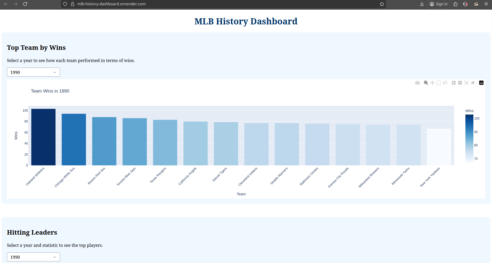
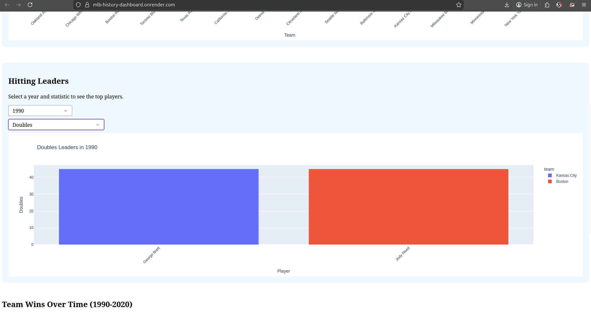
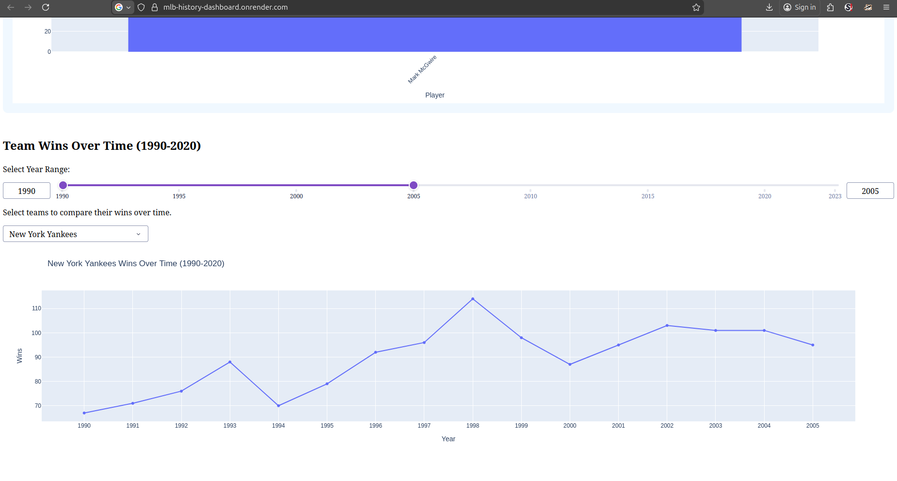

# Major League Baseball History Dashboard
A interactive dashboard that dsiplays American Major League Baseball History from 1990 to 2023.

## Project Overview 
This projcet scrapes the MLB data from the Baseball Almanac, stores it in a SQLite database, and displays it in a internactive Dash dashboard.

## Files 

- **official.scraper.py** - Uses Selenium to scrape team standings and hitting leaders from 1990-2023
- **clean_data.py** - Cleans and transform the raw CSV data using pandas 
- **import_to_sqlite.py** - Imports cleaned CSV files into SQLite database
- **query.py** - Query the database using SQL joins , select.
- **dashboard.py** - Interactive Dash dashboard with 3 visualization

## Visualizations 

1. **Top Team by Wins** - Bar chart showing team wins for selected year
2. **Hitting Leaders** - Bar chart shows top players for a selected statistic and year.
3. **Team Wins Over Time** - Line chart showing a team wins across years with a year range slider.

## Instructions to Setup

1. Clone the repositroy:

git clone: https://github.com/lillyp9/mlb-history-project.git

2. Create a virtual environment:

python3 -m venv .venv
(for Linux or Mac)
source .venv/bin/active

(Windows with CMD)
.\venv\Scripts\activate.bat

(Windows with Powershell)
.\venv\Script\activate.ps1

(Windows with Unix like Shells)
source venv\Scripts\activate

3. Install dependencies:

pip install -r requirements.txt

4. Run the scraper to collect data:

python3 src/official_scraper.py

5. Clean the data:

python3 src/clean_data.py

6. Import to database:

python3 src/import_to_sqlite.py

7. Run the dashboard:

python3 dashboard.py

8.  Open browser at 'http://127.0.0.1:8050/'

## Data Source 

[Baseball Almanac](https://www.baseball-almanac.com/yearmenu.shtml)

## Live Dashboard 

Render Deployment: https://mlb-history-dashboard.onrender.com/

## Screenshot 

### Top Teams by Wins

### Hitting Leaders 

### Team Wins Over Time 

